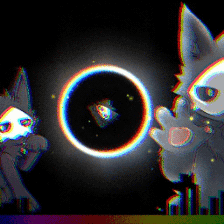

# Cute Puro Wallpaper (Wallpaper Engine)

Based on: https://steamcommunity.com/sharedfiles/filedetails/?id=2904739230  

Images found on:

- https://e926.net/posts/2651165
- https://e926.net/posts/1582056

## How to show this project in wallpaper editor?

- open wallpaper engine program folder
- Go to \projects\myprojects
- Clone git repo in this folder (This will create a new folder named cute_puro_wallpaper)
